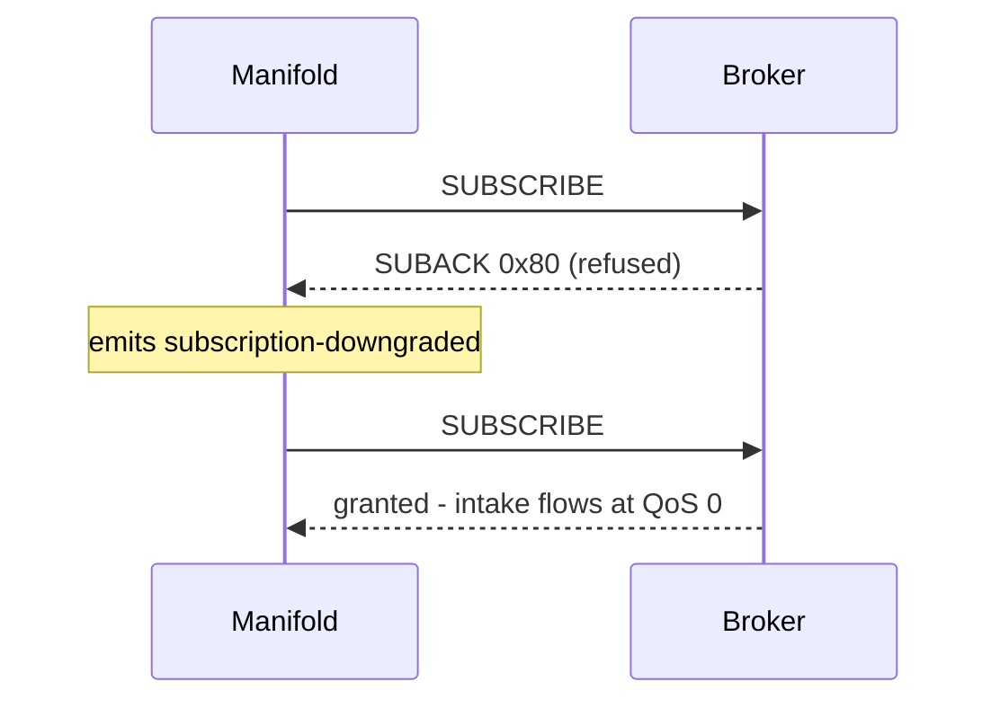
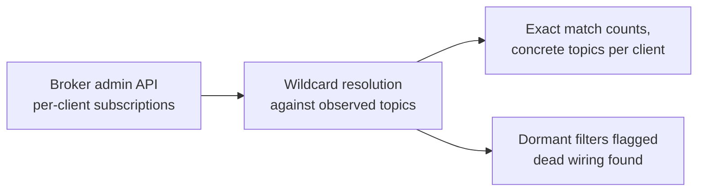

# 🔌 Broker setup

> **Goal:** durable intake from any broker, plus the extras — consumer
> lineage and per-client rates — that need a broker admin API.

## Intake QoS — what it means and why it matters

Manifold subscribes to `#` at **QoS 1** by default: if the connection hiccups,
the broker retransmits anything Manifold didn't acknowledge, so pipelines and
historians don't silently lose samples. It's configurable per broker
(connection form → *Subscribe QoS*). `$SYS/#` always uses QoS 0 — losing one
diagnostics sample is meaningless.

When a broker **refuses** the wildcard grant, Manifold reacts instead of going
quiet:



## ⚠️ EMQX: the silent deny

Stock EMQX ships an ACL that denies `#` and `$SYS/#` subscriptions at QoS 1+
from non-localhost clients — and because its default
`authorization.deny_action` is `ignore`, the denial is **invisible**: the
SUBACK reports success, the subscription simply never exists, and no client
in the world can detect it. The symptom is a connected broker with an empty
topic tree.

**Fix — allow the intake user in `etc/acl.conf`** (the allow rule must come
before the stock deny):

```erlang
%% Manifold intake — allow wildcard subscription at any QoS
{allow, {username, "manifold"}, subscribe, ["#", "$SYS/#"]}.

%% stock rules follow
{allow, {ipaddr, "127.0.0.1"}, all, ["$SYS/#", "#"]}.
{deny, all, subscribe, ["$SYS/#", {eq, "#"}]}.
{allow, all}.
```

<details>
<summary>Throwaway containers (CI, local testing) — clear authorization entirely</summary>

```yaml
environment:
  EMQX_AUTHORIZATION__NO_MATCH: allow
  EMQX_AUTHORIZATION__SOURCES: '[]'
```

Never do this on a shared broker — scope the allow rule to the intake user
instead.

</details>

Alternatively set the broker's *Subscribe QoS* to **0** in Manifold and accept
fire-and-forget intake.

## Mosquitto

Wildcard subscriptions work at any QoS out of the box — nothing to configure.
One honest limitation: Mosquitto has **no admin API** that lists live
per-client subscriptions (`mosquitto_ctrl` manages accounts and ACLs), so the
Flows → Consumers view falls back to observed-traffic resolution there.

## Admin APIs — unlocking consumer lineage

The Flows page answers *"who receives what?"* by fetching per-client
subscriptions from the broker's admin API and resolving every wildcard filter
against the topics actually observed:



Configure under **Brokers → Admin API**:

| Broker | API | Extras |
|---|---|---|
| EMQX v5 | REST, API key + secret | cumulative per-client counters, diffed into live msg/s per client |
| HiveMQ Enterprise | REST | per-client subscriptions |

Keys are stored server-side only and never echoed back.

## TLS

Choose the `mqtts` protocol in the connection form. For self-signed broker
certificates, disable *Reject unauthorized*.
