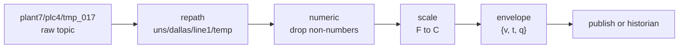
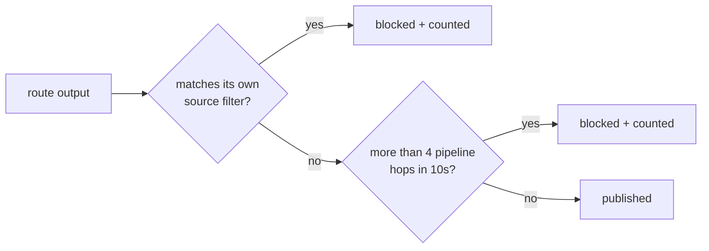
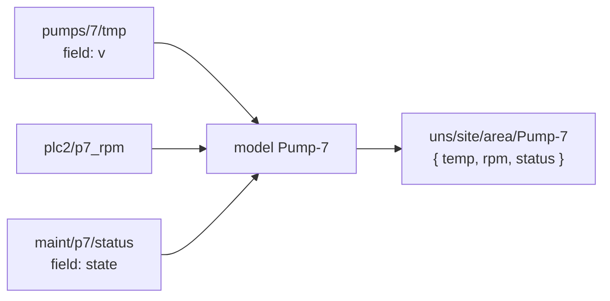

# 🔀 Pipelines and models

> **Goal:** turn a messy raw namespace into a clean, contextualized UNS —
> without guessing what a route will do before you switch it on.

## Anatomy of a route

A route consumes a topic filter on one broker, runs an ordered transform
chain, and delivers to a broker or a historian:

> 💡 **Always preview first.** Every route has a dry-run: Manifold resolves
> the filter against the topics actually observed on the broker and shows the
> exact in→out topic and payload mapping — nothing is published.

## Transform reference

| Transform | Effect | Example |
|---|---|---|
| `repath` | Rewrite the topic with segment templates | `uns/{2}/{4-}` — `{n}` = source segment n, `{n-}` = n..end, `{topic}` = whole topic |
| `pick` | Keep only listed payload fields | `["temp","rpm"]` |
| `rename` | Rename payload fields | `{"tmp":"temperature"}` |
| `set` | Merge fixed values into the payload | `{"site":"dallas"}` |
| `scale` | `value * mul + add` on the payload or one field | °F → °C: `mul 0.5556, add -17.78` |
| `numeric` | Coerce to number; **drops** non-numeric messages | filter semantics |
| `sparkplugFlatten` | Decoded Sparkplug metrics → `{ name: value }`; `is_null` metrics become explicit `null` | |
| `envelope` | Wrap as TVQ `{ v, t, q }` — value, source timestamp, quality | consumers can tell "zero" from "dead" |

## Loop protection — why you can't blow up your broker

Re-pathing makes accidental feedback loops easy (route output matching
another route's input, possibly across brokers). Manifold blocks them twice:

The hop counter catches indirect A→B→A cycles that no static check can see
through templates. Blocked counts appear on the route card.

## Models — many topics, one object

A model merges attributes plucked from many raw topics (even across brokers)
into **one object at a clean UNS path**:

Publish on change (debounced) or on an interval. In envelope mode each
attribute carries `{v, t, q}` with staleness-derived quality — good 192,
uncertain 64, bad 0 — so a stale sensor is visible in the data itself.

## Delivering to a historian

Pick a configured historian as the route target; delivery rides the
store-and-forward outbox described in [Historians](Historians).
